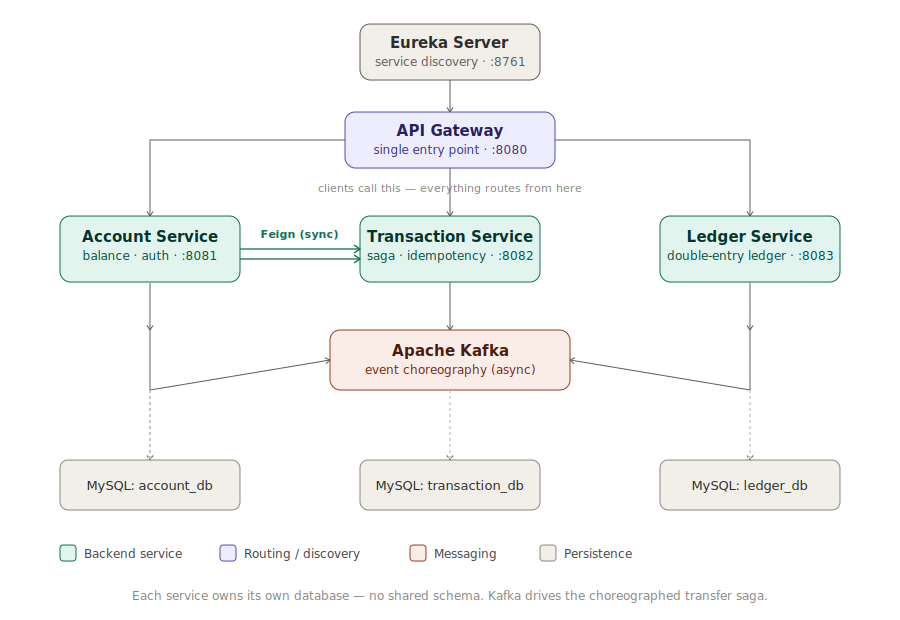

# Digital Wallet — Microservices Fund Transfer System

A production-style digital wallet built with Spring Boot microservices, demonstrating distributed transaction handling (Saga pattern), idempotency, optimistic concurrency control, double-entry ledger accounting, and JWT-based security — patterns commonly used in real BFSI/payments systems.

## Architecture



Each service owns its own database — no shared schema. Communication between services is synchronous (Feign, for balance/ownership checks) and asynchronous (Kafka, for the transfer saga).

Each service owns its own MySQL database (database-per-service pattern). Services communicate synchronously via Feign (balance checks, ownership checks) and asynchronously via Kafka (the transfer saga). All client traffic goes through the API Gateway, which resolves backend services via Eureka.

## Services

| Service | Port | Responsibility |
|---|---|---|
| Eureka Server | 8761 | Service discovery |
| API Gateway | 8080 | Single entry point, routes requests to backend services |
| Account Service | 8081 | Account CRUD, balance, debit/credit, authentication (JWT issuance) |
| Transaction Service | 8082 | Transfer orchestration, saga state, idempotency, authorization |
| Ledger Service | 8083 | Immutable double-entry ledger, reconciliation |

## The Saga Flow

Money transfer is handled as a choreographed saga across Kafka topics — not a distributed transaction — since each service owns its own database.

**Happy path:**
```
1. POST /api/transactions -> Transaction Service saves Transfer (INITIATED), publishes TransferInitiated
2. Account Service debits fromAccount -> publishes DebitCompleted
3. Transaction Service consumes DebitCompleted -> publishes CreditRequested
4. Account Service credits toAccount -> publishes CreditCompleted
5. Transaction Service marks Transfer COMPLETED
6. Ledger Service independently consumes DebitCompleted + CreditCompleted -> writes double-entry rows
```

**Failure/compensation path** (e.g. destination account frozen):
```
4. Account Service rejects credit -> publishes CreditFailed
5. Transaction Service marks Transfer FAILED, publishes CompensateDebit
6. Account Service reverses the original debit -> publishes DebitReversed
```

Result: no money is ever lost or stuck, even when a step downstream fails.

## Key Design Decisions

- **Choreography over orchestration** — each service reacts to events independently rather than a central coordinator directing every step.
- **Idempotency keys** — every transfer request requires an `Idempotency-Key` header. A duplicate key with identical request data returns the original result; a duplicate key with different data returns `409 Conflict`.
- **Optimistic locking (`@Version`)** — prevents over-withdrawal when two transfers hit the same account simultaneously. Verified with a concurrent JUnit test using two threads and a `CountDownLatch`; on conflict, the losing thread re-reads the fresh balance and correctly re-evaluates.
- **Double-entry ledger, append-only** — every completed transfer writes exactly one DEBIT and one CREDIT row. A scheduled reconciliation job periodically verifies debits equal credits across all transactions.
- **Separate Kafka consumer groups per service** — Transaction Service and Ledger Service both independently consume `debit-completed`/`credit-completed`; each needs its own consumer group so Kafka fans the event out to both rather than load-balancing between them.
- **JWT authentication + cross-service authorization** — Account Service issues tokens; Transaction Service validates them and forwards them via a Feign `RequestInterceptor` so downstream calls to Account Service stay authenticated. A user can only initiate a transfer from an account they own — enforced server-side, not trusted from the client.
- **API Gateway with service discovery routing** — clients only need to know one address (`localhost:8080`); the gateway resolves the correct backend service via Eureka (`lb://service-name`) rather than hardcoded hosts/ports.

## Running Locally

### Prerequisites
- Java 17
- Maven
- Docker Desktop (for Kafka/Zookeeper, and for Testcontainers-based integration tests)
- MySQL running locally (each service expects its own schema — see below)

### 1. Create the MySQL schemas

```sql
CREATE DATABASE account_db;
CREATE DATABASE transaction_db;
CREATE DATABASE ledger_db;
```

(Adjust to match whatever schema names your actual `application.yaml` files use.)

### 2. Start infrastructure

```bash
docker-compose up -d
```
Starts Kafka and Zookeeper.

### 3. Start services, in order — waiting for each to fully start before the next

```bash
cd eureka-server && ./mvnw spring-boot:run
```
Confirm `http://localhost:8761` loads with zero instances, then:

```bash
cd account-service && ./mvnw spring-boot:run
cd transaction-service && ./mvnw spring-boot:run
cd ledger-service && ./mvnw spring-boot:run
cd api-gateway && ./mvnw spring-boot:run
```

### 4. Verify

Open `http://localhost:8761` — all four services should be registered and `UP`.

> **Note on hostnames**: on some Windows/Docker setups, Eureka clients can auto-detect an unusable network hostname (e.g. a Docker-injected or Hyper-V virtual network name) instead of `localhost`. If services register under something other than `localhost:<port>`, add the following to each service's config and restart:
> ```yaml
> eureka:
>   instance:
>     prefer-ip-address: true
>     ip-address: 127.0.0.1
>     instance-id: ${spring.application.name}:${server.port}
> spring:
>   cloud:
>     inetutils:
>       default-hostname: localhost
>       default-ip-address: 127.0.0.1
> ```

## API Examples

All examples route through the API Gateway (`localhost:8080`). Individual service ports (8081/8082/8083) remain available for direct testing/debugging.

**Register and log in**
```bash
curl -X POST http://localhost:8080/api/auth/register \
  -H "Content-Type: application/json" \
  -d '{"username": "aniket", "password": "test1234"}'

curl -X POST http://localhost:8080/api/auth/login \
  -H "Content-Type: application/json" \
  -d '{"username": "aniket", "password": "test1234"}'
```
Copy the `token` from the login response for the requests below.

**Create an account**
```bash
curl -X POST http://localhost:8080/api/accounts \
  -H "Authorization: Bearer <token>" \
  -H "Content-Type: application/json" \
  -d '{"accountType": "SAVINGS", "initialBalance": 1000.00, "currency": "INR"}'
```

**Transfer funds**
```bash
curl -X POST http://localhost:8080/api/transactions \
  -H "Authorization: Bearer <token>" \
  -H "Content-Type: application/json" \
  -H "Idempotency-Key: unique-key-123" \
  -d '{"fromAccountId": 1, "toAccountId": 2, "amount": 200.00}'
```

**Check transfer status**
```bash
curl http://localhost:8080/api/transactions/{id} -H "Authorization: Bearer <token>"
```

**View ledger entries for a transfer**
```bash
curl http://localhost:8080/api/ledger/transaction/{transactionId} -H "Authorization: Bearer <token>"
```

## Running Tests

```bash
cd transaction-service

# Fast unit tests (idempotency logic, ownership checks) - no Docker needed
./mvnw test -Dtest=TransactionServiceIdempotencyTest

# Integration test against real MySQL + Kafka via Testcontainers - Docker Desktop must be running
./mvnw test -Dtest=TransactionSagaIntegrationTest
```

## What's Implemented

- [x] Service discovery via Eureka
- [x] Synchronous balance/ownership checks via OpenFeign
- [x] Kafka-based choreographed saga (debit -> credit -> complete)
- [x] Compensation/rollback path for failed transfers
- [x] Idempotency with duplicate-key detection and conflict handling
- [x] Optimistic locking with bounded retry, verified under concurrent load
- [x] Double-entry ledger with append-only entries
- [x] Scheduled ledger reconciliation job
- [x] Spring Security + JWT authentication and authorization
- [x] Cross-service JWT propagation via Feign interceptor
- [x] Unit tests (Mockito) and integration tests (Testcontainers)
- [x] API Gateway with Eureka-based service discovery routing

## Roadmap / Possible Extensions

- [ ] Notification Service (consume `TransferCompleted`/`TransferFailed`, send confirmations)
- [ ] Centralized config server
- [ ] Full docker-compose bringing up all application services (currently infra-only; app services run locally)
- [ ] Observability: correlation IDs across services, Micrometer/Prometheus metrics

## Tech Stack

Java 17, Spring Boot 3.5.4, Spring Cloud 2025.0.0 (Eureka, OpenFeign, Gateway), Apache Kafka, MySQL, Spring Security + JJWT, Testcontainers, Docker.

## Key Bugs Found and Fixed Along the Way

A few of the more instructive ones, worth being able to discuss in an interview:

- **Missing `transaction.setIdempotencyKey(...)` call** — idempotency key was never persisted, silently defeating duplicate-request detection until traced via direct DB inspection.
- **`debit()` validated balance but never actually subtracted it** — caught via a concurrency test that unexpectedly left the balance unchanged.
- **Kafka consumer group collisions** — Transaction Service and Ledger Service both consuming the same topics under the same `group.id`, causing one to silently starve; fixed by giving each service its own consumer group.
- **`JsonDeserializer` type header mismatches** across services with different base packages — resolved via `USE_TYPE_INFO_HEADERS=false` and explicit `VALUE_DEFAULT_TYPE`.
- **Eureka registering with non-`localhost` hostnames** (`host.docker.internal`, Hyper-V `.bbrouter`/`.mshome.net` addresses) due to Docker Desktop/WSL network interface injection on Windows — resolved via explicit `eureka.instance` overrides (`prefer-ip-address`, `ip-address`, `instance-id`) and `spring.cloud.inetutils` overrides.
- **Orphaned Java processes** causing duplicate/competing Eureka registrations — resolved by identifying and killing stale processes before restarting cleanly.